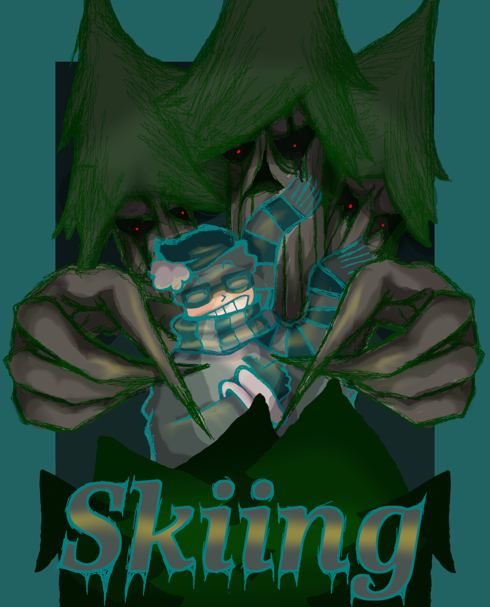

# SKIING2: The Shining Road

*A narrative-driven DOS adventure through a desolate frozen world*

*Created by Friends With Skelefits*

## About

SKIING2: The Shining Road is a 40th anniversary tribute to the classic DOS game "SKIING" (also known as "DOWNHILL.EXE") created by Rick Dean. This sequel maintains the core gameplay of the original while introducing multiplayer support and a dark, atmospheric narrative set in a post-apocalyptic frozen world.

## Story

You play as an inhabitant of Frostbite City, the seemingly last bastion of civilization in a frozen wasteland. The City Council claims life outside is impossible, but rumors of an "Evangelist" speaking of a "Shining Path" have begun to circulate.

Leaving the warmth of Frostbite City is considered deadly for the unprepared. Civilians rely on burdensome battery packs to power their thermal suits when venturing outside the city walls. However, the Evangelist preaches of a Celestial Tower that lies beyond the shadow of the city's mountain—beyond the range of city batteries.

The game follows your journey as you venture beyond the city walls, following the mysterious Shining Path toward the enigmatic Celestial Tower.

Upon pinnacle of the Celestial Tower sits the Greater Light—a source of warmth and safety for the tower's subjects that prevents frost and darkness from covering the tower and surrounding lands. The citizens of Frostbite City know nothing of such warmth, living in their isolated and frigid existence.

## Classic Gameplay

SKIING2 retains the core mechanics that made the original game enjoyable, but adds the following improvements:

Key improvements over the original:
- **Multiplayer support**: Up to 4 players can ski simultaneously
- **Performance enhancements**: No slowdown when many trees appear on screen
- **Story elements**: A narrative that unfolds between skiing sections

## Controls

- **Player 1**: F (left), G (straight), H (right)
- **Player 2**: J (left), K (straight), L (right)
- **Player 3**: Z (left), X (straight), C (right) 
- **Player 4**: B (left), N (straight), M (right)
- **ESC**: Exit game

## Technical Requirements

- 8088 processor or better, adjust game speed using + and -